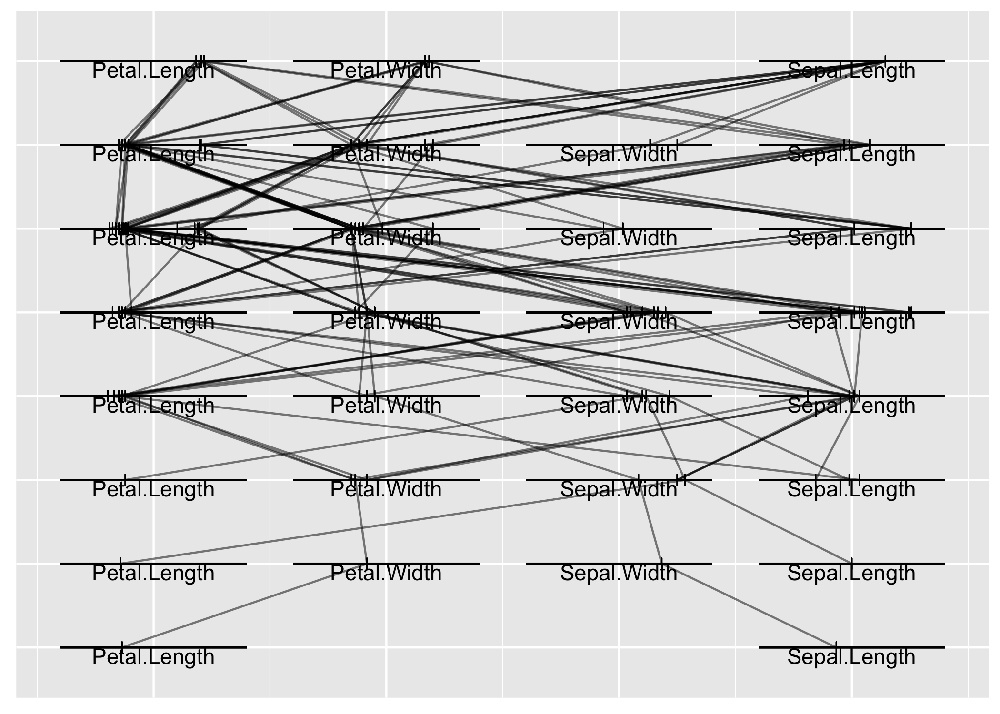

# TreeTracer

🌳 🌲 🎋 🎋 🎋 🎄 🌳 🌳 🌴 🎋 🎋 🌲 🎄 🎄

The beginnings…

TreeTracer is an R package for creating trace plots of trees from random
forests fit using the randomForest R package. Trace plots are useful
tools for visually comparing trees from a random forest. See Urbanek
(2008) for additional information about trace plots.

Examples:

``` r
# Load the package
library(TreeTracer)
```

``` r
# Fit a random forest using the iris data
set.seed(71)
iris.rf <- randomForest::randomForest(Species ~ ., data = iris)
```

``` r
# Generate a trace plot of the first 25 trees in the forest
trace_plot(
  rf = iris.rf,
  train = iris[, -5],
  tree_ids = 1:10
)
```

<!-- -->

``` r
# Adjust the width of horizontal feature lines and alpha of traces
trace_plot(
  rf = iris.rf,
  train = iris[, -5],
  tree_ids = 1:10,
  width = 0.5,
  alpha = 0.25
)
```

<!-- -->

## References

<div id="refs" class="references">

<div id="ref-urbanek:2008">

Urbanek, Simon. 2008. “Visualizing Trees and Forests.” In *Handbook of
Data Visualization*, edited by Chun-houh Chen, Wolfgang Härdle, and
Antony Unwin, 3:243–66. Berlin, Germany: Springer-Verlag.
<https://doi.org/10.1007/978-3-540-33037-0>.

</div>

</div>
