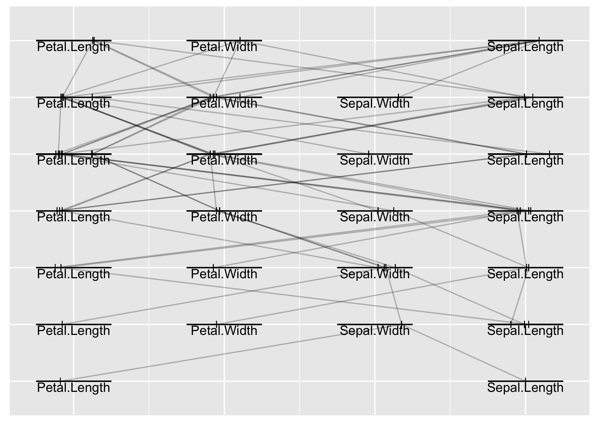
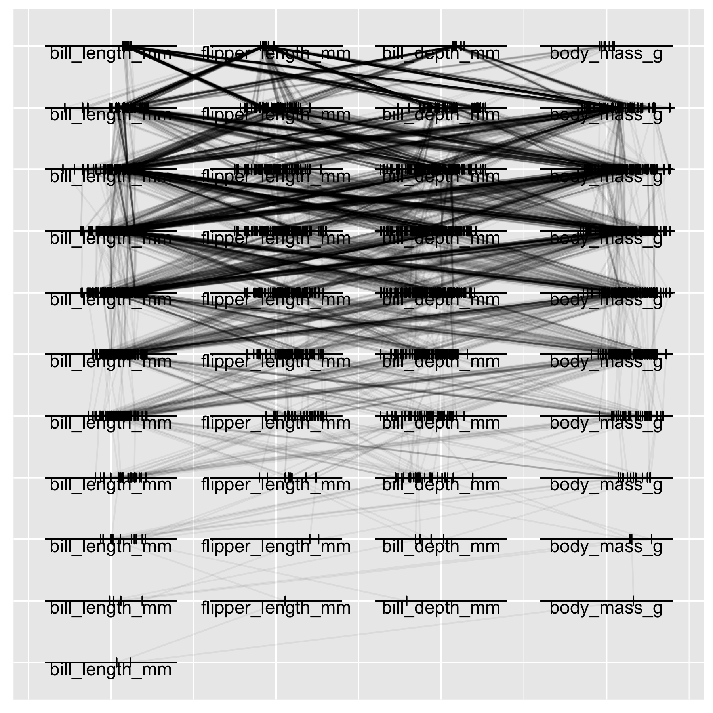

# TreeTracer 🌲 🖊

The beginnings…

TreeTracer is an R package for creating trace plots of trees from random
forests fit using the randomForest R package. Trace plots are useful
tools for visually comparing trees from a random forest. See Urbanek
(2008) for additional information about trace plots.

``` r
# Load packages
library(dplyr)
library(ggpcp)
library(ggplot2)
library(TreeTracer)
```

## Penguin data

``` r
# Load the Palmer penguins data
penguins <- na.omit(palmerpenguins::penguins)
```

``` r
# Select the features for training the model
penguin_features <- 
  penguins %>% 
  select(bill_length_mm, bill_depth_mm, flipper_length_mm, body_mass_g)
```

``` r
# Create a parallel coordinate plot of features that will
# be used to fit a random forest colored by the variable 
# of interest to predict (species)
penguins %>%
  ggplot(aes(color = species)) +
  geom_pcp(aes(
    vars = vars(
      bill_length_mm, 
      bill_depth_mm, 
      flipper_length_mm, 
      body_mass_g
    )
  ), alpha = 0.5) + 
  scale_color_brewer(palette = "Paired")
```

<!-- -->

## Random forest model

``` r
# Fit a random forest
set.seed(71)
penguin_rf <-
  randomForest::randomForest(
    species ~ bill_length_mm + bill_depth_mm + flipper_length_mm + body_mass_g,
    data = penguins, 
    ntree = 50
  )
```

``` r
# Print feature importance
penguin_rf$importance %>% 
  data.frame() %>% 
  arrange(desc(MeanDecreaseGini))
```

    ##                   MeanDecreaseGini
    ## bill_length_mm            86.66136
    ## flipper_length_mm         79.23500
    ## bill_depth_mm             29.98416
    ## body_mass_g               14.95287

``` r
# Trace plots of trees in the forest
trace_plot(
  rf = penguin_rf,
  train = penguin_features,
  tree_ids = 1:penguin_rf$ntree,
  alpha = 0.4
) + 
  theme(aspect.ratio = 1)
```

<!-- -->

## References

<div id="refs" class="references">

<div id="ref-urbanek:2008">

Urbanek, Simon. 2008. “Visualizing Trees and Forests.” In *Handbook of
Data Visualization*, edited by Chun-houh Chen, Wolfgang Härdle, and
Antony Unwin, 3:243–66. Berlin, Germany: Springer-Verlag.
<https://doi.org/10.1007/978-3-540-33037-0>.

</div>

</div>
