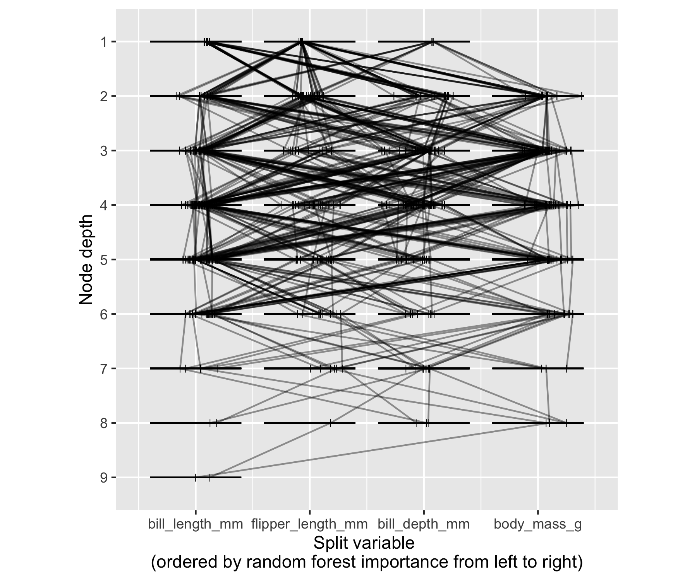
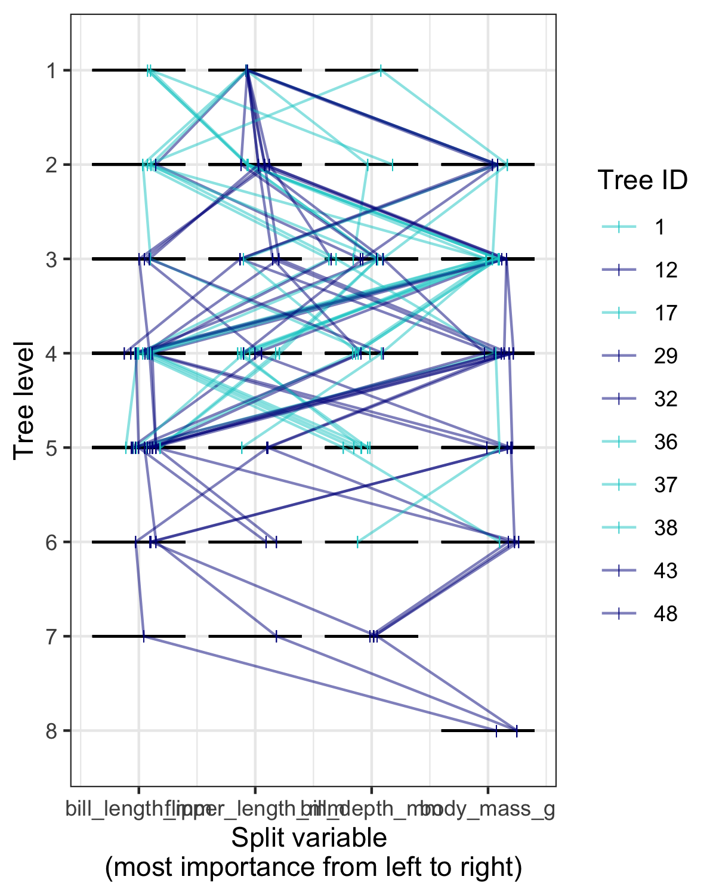
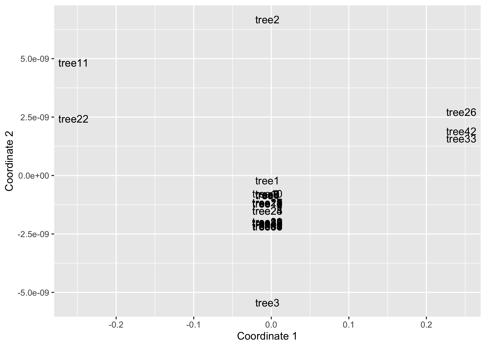
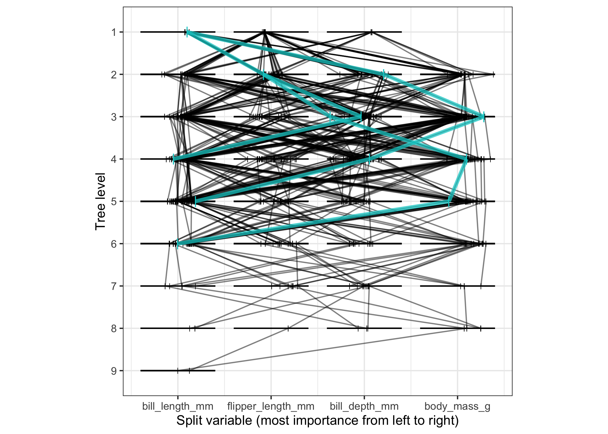

# TreeTracer 🎄 🖊

The beginnings…

TreeTracer is an R package for creating trace plots of trees from random
forests fit using the randomForest R package. Trace plots are useful
tools for visually comparing trees from a random forest. See Urbanek
(2008) for additional information about trace plots.

Examples:

``` r
# Load the package
library(TreeTracer)
```

    ## Registered S3 method overwritten by 'GGally':
    ##   method from   
    ##   +.gg   ggplot2

``` r
# Load other packages
library(dplyr)
library(ggpcp)
library(ggplot2)
```

## Random forest model

``` r
# Load the Palmer penguins data
penguins <- na.omit(palmerpenguins::penguins)
```

``` r
# Create a parallel coordinate plot of features that will be used to fit
# a random forest colored by the variable of interest to predict (species)
penguins %>%
  ggplot(aes(color = species)) +
  geom_pcp(aes(
    vars = vars(bill_length_mm, bill_depth_mm, flipper_length_mm, body_mass_g)
  ), alpha = 0.5) + 
  scale_color_brewer(palette = "Paired")
```

<!-- -->

``` r
# Fit a random forest
set.seed(71)
penguin.rf <-
  randomForest::randomForest(
    species ~ bill_length_mm + bill_depth_mm + flipper_length_mm + body_mass_g,
    data = penguins, 
    ntree = 50
  )
```

## Trace plots of trees

``` r
# Generate a trace plot of the first 10 trees in the forest
trace_plot(
  rf = penguin.rf,
  train = penguins %>% select(bill_length_mm, bill_depth_mm, flipper_length_mm, body_mass_g),
  tree_ids = 1:10
) + 
  theme(aspect.ratio = 1, axis.title = element_blank())
```

<!-- -->

``` r
# Plot all trees in the forest and adjust alpha
trace_plot(
  rf = penguin.rf,
  train = penguins %>% select(bill_length_mm, bill_depth_mm, flipper_length_mm, body_mass_g),
  tree_ids = 1:penguin.rf$ntree,
  alpha = 0.4
) + 
  theme(aspect.ratio = 1, axis.title = element_blank())
```

<!-- -->

## Comparison of trees: fit metric from Chipman, George, and McCulloch (1998)

Fit metric compares the predictions of the individual trees:

``` r
# Compute fit metrics between all trees
fit_metrics = compute_fit_metric(penguin.rf, penguins)
head(fit_metrics)
```

    ##   t1 t2 similarity
    ## 1  1  2   0.984985
    ## 2  1  3   0.981982
    ## 3  1  4   0.972973
    ## 4  1  5   0.981982
    ## 5  1  6   0.969970
    ## 6  1  7   0.981982

``` r
# Get the distance matrix
dist_matrix_fit <- get_dist_matrix(fit_metrics)
```

Hierarchical clustering:

``` r
stree <- hclust(dist_matrix_fit, method = "single")
ctree <- hclust(dist_matrix_fit, method = "complete")
atree <- hclust(dist_matrix_fit, method = "average")

par(mfcol=c(1,3))
plot(stree, ylab = "Distance", main = "Single linkage")
plot(ctree, ylab = "Distance", main = "Complete linkage")
plot(atree, ylab = "Distance", main = "Average linkage")
```

<!-- -->

Classic MDS:

``` r
mds_res <-
  cmdscale(dist_matrix_fit) %>% 
  data.frame() %>%
  rename("Coordinate 1" = "X1", "Coordinate 2" = "X2") %>%
  tibble::rownames_to_column("Tree")

ggplot(mds_res, aes(x = `Coordinate 1`, y = `Coordinate 2`)) + 
  geom_text(aes(label = Tree))
```

<!-- -->

``` r
# Plot tree 8 versus some others to see if any noticeable differences
trace_plot(
  rf = penguin.rf,
  train = penguins %>% select(bill_length_mm, bill_depth_mm, flipper_length_mm, body_mass_g),
  tree_ids = c(12, 27, 3, 10), 
  color_by_id = TRUE,
  alpha = 1
) + 
  scale_color_manual(values = c(rep("grey60", 2), "cyan4", "grey60")) + 
  theme(aspect.ratio = 1, axis.title = element_blank())
```

<!-- -->

``` r
# Plot tree 8 versus some others to see if any noticeable differences
trace_plot(
  rf = penguin.rf,
  train = penguins %>% select(bill_length_mm, bill_depth_mm, flipper_length_mm, body_mass_g),
  tree_ids = c(27, 3, 10), 
  alpha = 1,
  rep_tree = get_tree_data(penguin.rf, 12) %>% mutate(tree = "rep"),
  rep_tree_size = 1.5,
  rep_tree_alpha = 0.57
) + 
  theme(aspect.ratio = 1, axis.title = element_blank())
```

<!-- -->

``` r
# Plot tree 8 versus some others to see if any noticeable differences
trace_plot(
  rf = penguin.rf,
  train = penguins %>% select(bill_length_mm, bill_depth_mm, flipper_length_mm, body_mass_g),
  tree_ids = 1:penguin.rf$ntree,
  color_by_id = TRUE,
  alpha = 0.25
) +
  scale_color_manual(values = c(
    rep("grey20", 11),
    "orange",
    rep("grey20", 19),
    "orange",
    rep("grey20", 18)
  )) +
  theme(legend.position = "none") + 
  theme(aspect.ratio = 1, axis.title = element_blank())
```

<!-- -->

``` r
trace_plot(
  rf = penguin.rf,
  train = penguins %>% select(bill_length_mm, bill_depth_mm, flipper_length_mm, body_mass_g),
  tree_ids = 1:penguin.rf$ntree, 
  rep_tree = get_tree_data(penguin.rf, 12) %>% mutate(tree = "rep"), 
  rep_tree_size = 1.5,
  rep_tree_alpha = 0.5
) + 
  theme(aspect.ratio = 1, axis.title = element_blank())
```

<!-- -->

## Comparison of trees: covariate metric from Banerjee, Ding, and Noone (2012)

Covariate metric compares similarities between covariates used

``` r
# Compute fit metrics between all trees
cov_metrics = compute_covariate_metric(penguin.rf)
head(cov_metrics)
```

    ##   t1 t2 similarity
    ## 1  1  2          1
    ## 2  1  3          1
    ## 3  1  4          1
    ## 4  1  5          1
    ## 5  1  6          1
    ## 6  1  7          1

``` r
# Get the distance matrix
dist_matrix_cov <- get_dist_matrix(cov_metrics)
```

Hierarchical clustering:

``` r
stree <- hclust(dist_matrix_cov, method = "single")
ctree <- hclust(dist_matrix_cov, method = "complete")
atree <- hclust(dist_matrix_cov, method = "average")

par(mfcol=c(1,3))
plot(stree, ylab = "Distance", main = "Single linkage")
plot(ctree, ylab = "Distance", main = "Complete linkage")
plot(atree, ylab = "Distance", main = "Average linkage")
```

<!-- -->

Classic MDS:

``` r
mds_res <-
  cmdscale(dist_matrix_cov) %>% 
  data.frame() %>%
  rename("Coordinate 1" = "X1", "Coordinate 2" = "X2") %>%
  tibble::rownames_to_column("Tree")

ggplot(mds_res, aes(x = `Coordinate 1`, y = `Coordinate 2`)) + 
  geom_text(aes(label = Tree))
```

<!-- -->

``` r
# Plot tree 8 versus some others to see if any noticeable differences
trace_plot(
  rf = penguin.rf,
  train = penguins %>% 
    select(bill_length_mm, bill_depth_mm, flipper_length_mm, body_mass_g),
  tree_ids = c(11, 22, 42, 26, 33),
  color_by_id = TRUE,
  alpha = 0.9
) +
  scale_color_manual(values = c(rep("cyan4", 2), rep("darkblue", 3))) + 
  theme_bw() + 
  theme(aspect.ratio = 1)
```

<!-- -->

Could be made more useful…shows where the two trees disagree with
predictions

``` r
plot_tree_preds(
  rf = penguin.rf,
  data = penguins %>% select(bill_length_mm, bill_depth_mm, flipper_length_mm, body_mass_g),
  t1 = 11,
  t2 = 26
)
```

<!-- -->

``` r
# Plot tree 8 versus some others to see if any noticeable differences
trace_plot(
  rf = penguin.rf,
  train = penguins %>% select(bill_length_mm, bill_depth_mm, flipper_length_mm, body_mass_g),
  tree_ids = 1:penguin.rf$ntree,
  rep_tree = get_tree_data(penguin.rf, 2) %>% mutate(tree = "rep"),
  rep_tree_color = "cyan4",
  rep_tree_size = 1.5,
  rep_tree_alpha = 0.75
) + 
  theme_bw() + 
  theme(aspect.ratio = 1)
```

<!-- -->

## References

<div id="refs" class="references">

<div id="ref-banerjee:2012">

Banerjee, Mousumi, Ying Ding, and Anne-Michelle Noone. 2012.
“Identifying representative trees from ensembles.” *Statistics in
Medicine* 31 (15): 1601–16. <https://doi.org/10.1002/sim.4492>.

</div>

<div id="ref-chipman:1998">

Chipman, H. A., E. I. George, and R. E. McCulloch. 1998. “Making sense
of a forest of trees.” In *Proceedings of the 30th Symposium on the
Interface*, 84—92.
<http://citeseerx.ist.psu.edu/viewdoc/summary?doi=10.1.1.42.2598>.

</div>

<div id="ref-urbanek:2008">

Urbanek, Simon. 2008. “Visualizing Trees and Forests.” In *Handbook of
Data Visualization*, edited by Chun-houh Chen, Wolfgang Härdle, and
Antony Unwin, 3:243–66. Berlin, Germany: Springer-Verlag.
<https://doi.org/10.1007/978-3-540-33037-0>.

</div>

</div>
