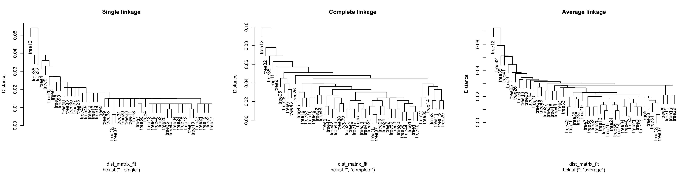
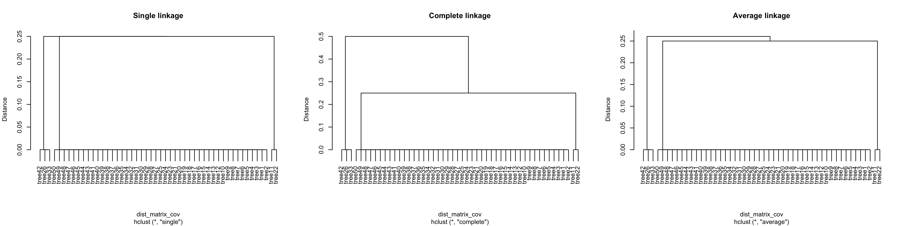

# TreeTracer 🌳 🖊

The beginnings…

TreeTracer is an R package for creating trace plots of trees from random
forests fit using the randomForest R package. Trace plots are useful
tools for visually comparing trees from a random forest. See Urbanek
(2008) for additional information about trace plots.

``` r
# Load packages
library(dplyr)
library(ggpcp)
library(ggplot2)
library(TreeTracer)
```

## Penguin data

``` r
# Load the Palmer penguins data
penguins <- na.omit(palmerpenguins::penguins)
```

``` r
# Select the features for training the model
penguin_features <- 
  penguins %>% 
  select(bill_length_mm, bill_depth_mm, flipper_length_mm, body_mass_g)
```

``` r
# Create a parallel coordinate plot of features that will
# be used to fit a random forest colored by the variable 
# of interest to predict (species)
penguins %>%
  ggplot(aes(color = species)) +
  geom_pcp(aes(
    vars = vars(
      bill_length_mm, 
      bill_depth_mm, 
      flipper_length_mm, 
      body_mass_g
    )
  ), alpha = 0.5) + 
  scale_color_brewer(palette = "Paired")
```

<!-- -->

## Random forest model

``` r
# Fit a random forest
set.seed(71)
penguin_rf <-
  randomForest::randomForest(
    species ~ bill_length_mm + bill_depth_mm + flipper_length_mm + body_mass_g,
    data = penguins, 
    ntree = 50
  )
```

``` r
# Print feature importance
penguin_rf$importance %>% 
  data.frame() %>% 
  arrange(desc(MeanDecreaseGini))
```

    ##                   MeanDecreaseGini
    ## bill_length_mm            86.66136
    ## flipper_length_mm         79.23500
    ## bill_depth_mm             29.98416
    ## body_mass_g               14.95287

``` r
# Trace plots of trees in the forest
trace_plot(
  rf = penguin_rf,
  train = penguin_features,
  tree_ids = 1:penguin_rf$ntree,
  alpha = 0.4
) + 
  theme(aspect.ratio = 1)
```

<!-- -->

## Comparison of trees

### Fit metric

Fit metric from Chipman, George, and McCulloch (1998) compares the
predictions of the individual trees:

``` r
# Compute fit metrics between all trees
fit_metrics = compute_fit_metric(penguin_rf, penguins)
head(fit_metrics)
```

    ##   t1 t2 similarity
    ## 1  1  2   0.984985
    ## 2  1  3   0.981982
    ## 3  1  4   0.972973
    ## 4  1  5   0.981982
    ## 5  1  6   0.969970
    ## 6  1  7   0.981982

``` r
# Get the distance matrix
dist_matrix_fit <- get_dist_matrix(fit_metrics)
```

Hierarchical clustering:

``` r
stree <- hclust(dist_matrix_fit, method = "single")
ctree <- hclust(dist_matrix_fit, method = "complete")
atree <- hclust(dist_matrix_fit, method = "average")

par(mfcol=c(1,3))
plot(stree, ylab = "Distance", main = "Single linkage")
plot(ctree, ylab = "Distance", main = "Complete linkage")
plot(atree, ylab = "Distance", main = "Average linkage")
```

<!-- -->

Classic MDS:

``` r
mds_res <-
  cmdscale(dist_matrix_fit) %>% 
  data.frame() %>%
  rename("Coordinate 1" = "X1", "Coordinate 2" = "X2") %>%
  tibble::rownames_to_column("Tree")

ggplot(mds_res, aes(x = `Coordinate 1`, y = `Coordinate 2`)) + 
  geom_text(aes(label = Tree))
```

<!-- -->

Plot highlighting the outlier trees of 12 and 32:

``` r
cowplot::plot_grid(
  
  trace_plot(
    rf = penguin_rf,
    train = penguin_features,
    tree_ids = 1:penguin_rf$ntree,
    alpha = 0.75,
    rep_tree = get_tree_data(penguin_rf, 32),
    rep_tree_size = 1.5,
    rep_tree_alpha = 0.75,
    rep_tree_color = "cyan3"
  ) +
    theme(aspect.ratio = 1) + 
    labs(title = "Highlight of tree 12"),
  
  trace_plot(
    rf = penguin_rf,
    train = penguin_features,
    tree_ids = 1:penguin_rf$ntree,
    alpha = 0.75,
    rep_tree = get_tree_data(penguin_rf, 12),
    rep_tree_size = 1.5,
    rep_tree_alpha = 0.75,
    rep_tree_color = "cyan3"
  ) +
    theme(aspect.ratio = 1) + 
    labs(title = "Highlight of tree 32")
  
)
```

<!-- -->

### Covariate metric

Covariate metric from Banerjee, Ding, and Noone (2012) compares
similarities between covariates used in a tree

``` r
# Compute fit metrics between all trees
cov_metrics = compute_covariate_metric(penguin_rf)
head(cov_metrics)
```

    ##   t1 t2 similarity
    ## 1  1  2          1
    ## 2  1  3          1
    ## 3  1  4          1
    ## 4  1  5          1
    ## 5  1  6          1
    ## 6  1  7          1

``` r
# Get the distance matrix
dist_matrix_cov <- get_dist_matrix(cov_metrics)
```

Hierarchical clustering:

``` r
stree <- hclust(dist_matrix_cov, method = "single")
ctree <- hclust(dist_matrix_cov, method = "complete")
atree <- hclust(dist_matrix_cov, method = "average")

par(mfcol=c(1,3))
plot(stree, ylab = "Distance", main = "Single linkage")
plot(ctree, ylab = "Distance", main = "Complete linkage")
plot(atree, ylab = "Distance", main = "Average linkage")
```

<!-- -->

Classic MDS:

``` r
mds_res <-
  cmdscale(dist_matrix_cov) %>% 
  data.frame() %>%
  rename("Coordinate 1" = "X1", "Coordinate 2" = "X2") %>%
  tibble::rownames_to_column("Tree")

ggplot(mds_res, aes(x = `Coordinate 1`, y = `Coordinate 2`)) + 
  geom_text(aes(label = Tree))
```

<!-- -->

Extreme trees in the direction of coordinate 1:

``` r
trace_plot(
  rf = penguin_rf,
  train = penguin_features,
  tree_ids = c(11, 22, 42, 26, 33),
  color_by_id = TRUE,
  alpha = 0.9
) +
  scale_color_manual(values = c(rep("cyan3", 2), rep("darkblue", 3))) + 
  theme_bw() + 
  theme(aspect.ratio = 1)
```

<!-- -->

Look at observations where the trees of 11 and 26 diagree (could be made
more useful…):

``` r
all_pred <-
  randomForest:::predict.randomForest(penguin_rf, penguin_features, predict.all = TRUE)

plot_data <-
  penguin_features %>%
  bind_cols(
    data.frame(all_pred$individual[, c(11, 26)]) %>%
      rename_all(
        .funs = function(x)
          stringr::str_replace(x, "X", "t")
      )
  ) %>%
  mutate(agree = t1 == t2) %>%
  mutate(t1 = factor(t1), t2 = factor(t2)) %>%
  select(agree, everything())
 
GGally::ggpairs(penguin_features, ggplot2::aes(color = plot_data$agree)) +
  labs(x = paste("Tree 11"), y = paste("Tree 26"))
```

<!-- -->

Extreme trees in the direction of coordinate 2:

``` r
trace_plot(
  rf = penguin_rf,
  train = penguin_features,
  tree_ids = c(2,3),
  color_by_id = TRUE,
  alpha = 0.9
) +
  scale_color_manual(values = c("cyan3", "darkblue")) + 
  theme_bw() + 
  theme(aspect.ratio = 1)
```

<!-- -->

Look at variability across the coordinate 2 direction:

``` r
trace_plot(
  rf = penguin_rf,
  train = penguin_features,
  tree_ids = 1:3,
  color_by_id = T, 
  facet_by_id = T, 
  nrow = 1, 
  alpha = 1
) + 
  scale_color_manual(values = c("cyan3", "blue", "darkblue")) + 
  theme_bw() + 
  theme(aspect.ratio = 2)
```

<!-- -->

Same three trees in one plot:

``` r
trace_plot(
  rf = penguin_rf,
  train = penguin_features,
  tree_ids = 1:3,
  color_by_id = T,
  max_depth = 4, 
  alpha = 0.9
) + 
  scale_color_manual(values = c("cyan3", "blue", "darkblue")) + 
  theme_bw() + 
  theme(aspect.ratio = 1)
```

<!-- -->

### Covariate metric (comparing only to tree level 3)

Covariate metric from Banerjee, Ding, and Noone (2012) compares
similarities between covariates used within the first three levels of
the trees

``` r
# Compute fit metrics between all trees
cov_metrics3 = compute_covariate_metric(penguin_rf, max_depth = 3)
head(cov_metrics3)
```

    ##   t1 t2 similarity
    ## 1  1  2       1.00
    ## 2  1  3       0.75
    ## 3  1  4       1.00
    ## 4  1  5       0.75
    ## 5  1  6       1.00
    ## 6  1  7       1.00

``` r
# Get the distance matrix
dist_matrix_cov3 <- get_dist_matrix(cov_metrics3)
```

Hierarchical clustering:

``` r
stree3 <- hclust(dist_matrix_cov3, method = "single")
ctree3 <- hclust(dist_matrix_cov3, method = "complete")
atree3 <- hclust(dist_matrix_cov3, method = "average")

par(mfcol = c(1,3))
plot(stree3, ylab = "Distance", main = "Single linkage")
plot(ctree3, ylab = "Distance", main = "Complete linkage")
plot(atree3, ylab = "Distance", main = "Average linkage")
```

<!-- -->

Classic MDS:

``` r
mds_res3 <-
  cmdscale(dist_matrix_cov3) %>% 
  data.frame() %>%
  rename("Coordinate 1" = "X1", "Coordinate 2" = "X2") %>%
  tibble::rownames_to_column("Tree")

ggplot(mds_res3, aes(x = `Coordinate 1`, y = `Coordinate 2`)) + 
  geom_point() + 
  geom_text(aes(label = Tree))
```

<!-- -->

``` r
ggplot(mds_res3, aes(x = `Coordinate 1`, y = `Coordinate 2`)) + 
  geom_point() + 
  ggrepel::geom_text_repel(aes(label = Tree))
```

<!-- -->

Plots of the clusters based on variables used in the first three levels:

``` r
cowplot::plot_grid(
  trace_plot(
    rf = penguin_rf,
    train = penguin_features,
    tree_ids = c(3, 5, 11, 17, 18, 19, 22, 27, 29, 34, 46, 49, 50)
  ) +
    theme_bw() +
    theme(aspect.ratio = 1),
  
  trace_plot(
    rf = penguin_rf,
    train = penguin_features,
    tree_ids = c(35)
  ) +
    theme_bw() +
    theme(aspect.ratio = 1),
  
  trace_plot(
    rf = penguin_rf,
    train = penguin_features,
    tree_ids = c(30)
  ) +
    theme_bw() +
    theme(aspect.ratio = 1),
  
  trace_plot(
    rf = penguin_rf,
    train = penguin_features,
    tree_ids = c(1, 2, 4, 6, 7, 8, 9, 15, 16, 20, 21, 25, 28, 37, 38, 39, 40, 44, 45)
  ) +
    theme_bw() +
    theme(aspect.ratio = 1),
  
  trace_plot(
    rf = penguin_rf,
    train = penguin_features,
    tree_ids = c(12, 13, 31, 41, 43, 47)
  ) +
    theme_bw() +
    theme(aspect.ratio = 1),
  
  trace_plot(
    rf = penguin_rf,
    train = penguin_features,
    tree_ids = c(10, 14, 23, 24, 26, 33, 36, 42)
  ) +
    theme_bw() +
    theme(aspect.ratio = 1)
  
)
```

<!-- -->

## References

<div id="refs" class="references">

<div id="ref-banerjee:2012">

Banerjee, Mousumi, Ying Ding, and Anne-Michelle Noone. 2012.
“Identifying representative trees from ensembles.” *Statistics in
Medicine* 31 (15): 1601–16. <https://doi.org/10.1002/sim.4492>.

</div>

<div id="ref-chipman:1998">

Chipman, H. A., E. I. George, and R. E. McCulloch. 1998. “Making sense
of a forest of trees.” In *Proceedings of the 30th Symposium on the
Interface*, 84—92.
<http://citeseerx.ist.psu.edu/viewdoc/summary?doi=10.1.1.42.2598>.

</div>

<div id="ref-urbanek:2008">

Urbanek, Simon. 2008. “Visualizing Trees and Forests.” In *Handbook of
Data Visualization*, edited by Chun-houh Chen, Wolfgang Härdle, and
Antony Unwin, 3:243–66. Berlin, Germany: Springer-Verlag.
<https://doi.org/10.1007/978-3-540-33037-0>.

</div>

</div>
